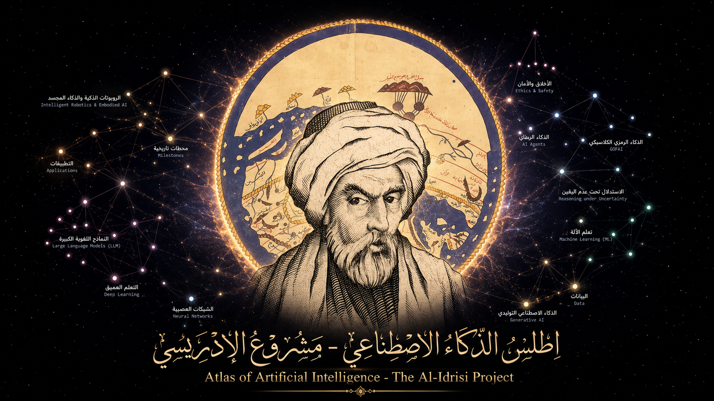

# Al-Idrisi.AI



[](https://github.com/Zo-Dns/Al-Idrisi.AI/actions/workflows/ci.yml)
[](https://github.com/Zo-Dns/Al-Idrisi.AI/actions/workflows/pages.yml)

**Al-Idrisi.AI** أطلس عربي مفتوح المصدر يشرح مفاهيم الذكاء الاصطناعي وعلاقاتها بصريا، مع عوالم غوص متخصصة ومختبرات تفاعلية ومكتبة مصادر رسمية وأكاديمية.

**[استكشف Al-Idrisi.AI مباشرة](https://zo-dns.github.io/Al-Idrisi.AI/)**

## ماذا يقدم المشروع؟

- خريطة أم تضم 106 مفاهيم رئيسية في الذكاء الاصطناعي.
- عشرة عوالم غوص متخصصة تضم 730 عقدة تعليمية.
- جولة كبرى من 14 خطوة تربط أسس الذكاء الاصطناعي بتطبيقاته ومسؤوليته.
- شرح عربي واضح مع إبقاء المصطلحات والأسماء الرسمية بالإنجليزية.
- رحلات معرفية مرتبة تساعد على فهم كل مجال تدريجيا.
- مختبرات حية ومختبرات 3D لتجربة الخوارزميات والمفاهيم رياضيا.
- مكتبة من 389 مصدرا رسميا وأكاديميا موثقا، مع روابط ومواضع الاستخدام.

تشمل عوالم الغوص: البيانات، تعلم الآلة، التعلم العميق، النماذج اللغوية الكبيرة، الأخلاق والأمان، التطبيقات، الذكاء الرمزي الكلاسيكي، التعلم المعزز، الذكاء الاحتمالي، وتاريخ الذكاء الاصطناعي.

## التشغيل محليا

يتطلب المشروع Node.js 20 أو أحدث:

```bash
git clone https://github.com/Zo-Dns/Al-Idrisi.AI.git
cd Al-Idrisi.AI
npm run serve
```

ثم افتح:

```text
http://localhost:8087/ai-how-ai-works.html
```

استخدم الخادم المحلي بدلا من فتح ملف HTML مباشرة، لكي تعمل مسارات جميع المختبرات المستقلة كما هي موثقة.

## البناء والتحقق

```bash
npm run build    # بناء ملف الأطلس النهائي
npm test         # تشغيل ملفات الاختبار الـ29
npm run verify   # البناء والاختبارات وفحص جاهزية الإطلاق
```

تُشغّل عملية التحقق نفسها تلقائيا في GitHub Actions قبل نشر الموقع على GitHub Pages.

## بنية المشروع باختصار

- `src/content/`: مفاهيم العوالم والعلاقات والرحلات.
- `src/labs/`: المختبرات التفاعلية المدمجة.
- `src/templates/`: واجهة الخريطة وقالب البناء المولد.
- `pages/`: صفحات الأطلس النهائية الجاهزة للعرض.
- `experiments/`: مختبرات 3D المستقلة.
- `scripts/`: أدوات البناء والتشغيل وتحديث تدقيق المصادر.
- `tests/`: اختبارات المحتوى والرياضيات والعلاقات والمختبرات.
- `data/academic/`: بيانات التحقق الببليوغرافي المنظمة.
- `docs/`: الوثائق الأكاديمية والقانونية وسجل التغييرات.

## الدقة والمصادر

خضع محتوى الخريطة الأم وعوالم الغوص لمراجعة عقدة بعقدة شملت التعريفات والعلاقات والتصنيف والرحلات والمصادر. تحفظ التفاصيل الفنية خارج README كي تبقى صفحة المشروع سهلة القراءة:

- [قائمة المراجعة الأكاديمية](docs/academic/ACADEMIC_REVIEW_CHECKLIST.md)
- [تقرير تدقيق المصادر](docs/academic/ACADEMIC_SOURCE_AUDIT.md)

المكتبة داخل الأطلس تميز بوضوح بين الأوراق العلمية والكتب والوثائق الأولية والصفحات الرسمية، ولا تصف كل المواد بأنها أبحاث محكمة.

## المساهمة

نرحب بتصحيح الأخطاء العلمية، واقتراح المصادر، وتحسين الواجهة والمختبرات. راجع [دليل المساهمة](.github/CONTRIBUTING.md) أو استخدم نماذج Issues المخصصة في المستودع.

إذا استخدمت المشروع في بحث أو مادة تعليمية، تتوفر بيانات الاستشهاد في [CITATION.cff](CITATION.cff).

## الترخيص

- البرمجيات: [MIT License](LICENSE)
- المحتوى التعليمي الأصلي: [CC BY 4.0](docs/legal/CONTENT_LICENSE.md)
- المكتبات والخطوط والبيانات الخارجية: [Third-party notices](docs/legal/THIRD_PARTY_NOTICES.md)

الإصدار الحالي: `v1.0-rc1`
